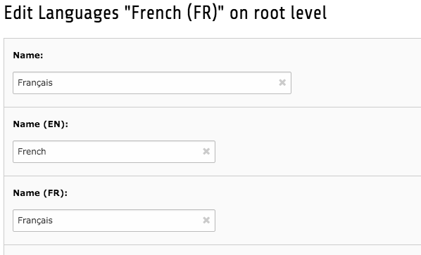

.. ==================================================
.. FOR YOUR INFORMATION
.. --------------------------------------------------
.. -*- coding: utf-8 -*- with BOM.

.. include:: ../Includes.txt

What does it do?
================

This extension provides French translation for the country, country subdivision, currenciy, language,
and territory records of static_info_tables. For this purpose, it adds one or two fields
to the those tables and fills them with French data, if available.

	Record view of the "French" language record with new field "Name (FR)" filled with the French translation.
